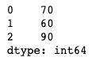
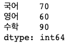

# pandas 라이브러리 다루기: Series

### 시리즈(Series) 이해하기

- 데이터를 다루기 위해 데이터 프레임(Dataframe)과 시리즈(Series) 제공
- 시리즈(Series)는 1차원(컬럼 1개) 데이터이고, 데이터프레임(Dataframe)이 테이블형(2차원)(컬럼 2개 이상) 데이터임

 

---

 

### Series 생성 (CRUD - Create)

<pre>
import pandas as pd
</pre>

<pre>
seriesdata = pd.Series([70, 60, 90])
print(seriesdata)
</pre>

출력 예:

 

- index는 행의 레이블을 의미함
- index를 지정하지 않으면 0부터 시작하는 인덱스 자동 생성
- 지정할 경우에는 지정된 index로 사용

<pre>
seriesdata = pd.Series([70, 60, 90], index=['국어', '영어', '수학'])
print(seriesdata)
</pre>

출력 예:

 

---

 

### Series 데이터 읽고 수정하기 (CRUD - Read & Update)

- series 인덱스 수정

<pre>
seriesdata.index = ['미술', '음악', '체육']
print(seriesdata)
</pre>

<pre>
출력 예:
	미술    70
	음악    60
	체육    90
	dtype: int64
</pre>

<pre>
print(seriesdata.values)
</pre>

<pre>
출력 예:
	array([70, 60, 90])
</pre>

 

- 특정 데이터 지정 가능 (출력, 수정 등 데이터 처리 가능)

<pre>
print (seriesdata['미술'], seriesdata[0])
</pre>

<pre>
출력예:
	70 70
</pre>

<pre>
seriesdata['미술'] = 80
print (seriesdata['미술'], seriesdata[0])
</pre>

<pre>
출력예:
	80 80	
</pre>

 

---

 

### Series 데이터 삭제하기 (CRUD - Delete)

<pre>
print(seriesdata)
</pre>

<pre>
출력 예:
	미술    80
	음악    60
	체육    90
	dtype: int64
</pre>

<pre>
del seriesdata['미술']
</pre>

<pre>
출력 예:
	음악    60
	체육    90
	dtype: int64
</pre>