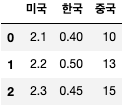
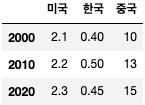
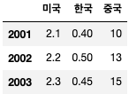
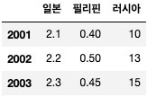
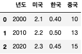
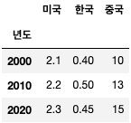
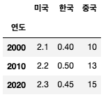
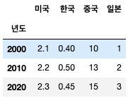

# pandas 라이브러리 다루기:데이터 프레임

### 데이터프레임(Dataframe) 이해하기

- 데이터프레임은 테이블형(2차원) 데이터이며, 데이터 분석/머신 러닝에서 데이터 처리를 위해 주로 사용됨
- 2차원이기 때문에 엑셀/csv와 같이 데이터가 row, column로 구성되며, 인덱스도 두 개, row/column 각각 존재함
  - 행의 레이블은 인덱스로, 열의 레이블은 컬럼으로 부름

<pre>
import pandas as pd
</pre>

 

---

 

### Dataframe 생성 (CRUD - Create)

<pre>
df = pd.DataFrame({
    "미국": [2.1, 2.2, 2.3],
    "한국": [0.4, 0.5, 0.45],
    "중국": [10, 13, 15]    
})
print(df)
</pre>

출력 예:

 

### 인덱스와 함께 생성하기

<pre>
df = pd.DataFrame({
    "미국": [2.1, 2.2, 2.3],
    "한국": [0.4, 0.5, 0.45],
    "중국": [10, 13, 15]},
    index=[2000, 2010, 2020]
)
print(df)
</pre>

출력 예:

 

### 데이터프레임은 index, columns, values (CRUD - Read & Update)

- Series 는 index 와 values

<pre>
# 행(row) 방향 index
print(df.index)
</pre>

<pre>
출력 예:
	Int64Index([2000, 2010, 2020], dtype='int64')
</pre>

<pre>
df.index = [2001, 2002, 2003]
print(df)
</pre>

출력 예:

 

<pre>
# 열(column) 방향 index
print(df.columns)
</pre>

<pre>
출력 예:
	Index(['미국', '한국', '중국'], dtype='object')
</pre>

<pre>
df.columns = ['일본', '필리핀', '러시아']
print(df)
</pre>

출력 예:

<pre>
print(df.values)
</pre>

<pre>
출력 예:
	array([[ 2.1 ,  0.4 , 10.  ],
       	   [ 2.2 ,  0.5 , 13.  ],
           [ 2.3 ,  0.45, 15.  ]])
</pre>

 

### 인덱스로 특정 컬럼 선택하기

<pre>
df = pd.DataFrame({
    "년도": [2000, 2010, 2020],    
    "미국": [2.1, 2.2, 2.3],
    "한국": [0.4, 0.5, 0.45],
    "중국": [10, 13, 15]    
})
print(df)
</pre>

출력 예:

<pre>
df = df.set_index('년도')
print(df)
</pre>

출력 예:

 

---

 

### 참고:

- 인덱스 이름
  - 데이터프레임.index.name 으로 확인 가능
  - 데이터프레임.index.name = 변경할인덱스이름 으로 수정 가능

<pre>
df.index.name
</pre>

<pre>
출력 예:
	'년도'
</pre>

<pre>
df.index.name = '연도'
print(df)
</pre>

출력 예:

 

### 인덱스 reset

- 인덱스 데이터를 컬럼으로 변경하기

<pre>
df = df.reset_index('연도')
print(df)
</pre>

출력 예:

 

<pre>
df = df.set_index('연도')
print(df)
</pre>

출력 예:

 

---

 

### 데이터프레임 데이터 접근하기

- 데이터프레임.loc : index 를 통해서 값을 찾음
- 데이터프레임.iloc : 인덱스 번호를 통해서 값을 찾음 (0부터 시작)

 

### 특정 행 가져오기

<pre>
print(type(df.loc[2000]))
</pre>

<pre>
출력 예:
	pandas.core.series.Series
</pre>

<pre>
print(df.loc[2000])
</pre>

<pre>
출력 예:
	미국     2.1
	한국     0.4
	중국    10.0
	Name: 2000, dtype: float64
</pre>

<pre>
print(df.iloc[0])
</pre>

<pre>
출력 예:
	미국     2.1
	한국     0.4
	중국    10.0
	Name: 2000, dtype: float64
</pre>

 

### 특정 열(컬럼) 가져오기 

- 특정 열(컬럼)은 Series

<pre>
print(type(df['미국']))
</pre>

<pre>
출력 예:
	pandas.core.series.Series
</pre>

 

<pre>
print(df['미국'])
</pre>

<pre>
출력 예:
	연도
	2000    2.1
	2010    2.2
	2020    2.3
	Name: 미국, dtype: float64
</pre>

 

<pre>
print(df)
</pre>

출력 예:

 

<pre>
print (df['미국'][2000])
print (df.loc[2000]['미국'])
</pre>

<pre>
출력 예:
	2.1
	2.1
</pre>

- 인덱스가 숫자로 입력됬는지, 문자로 입력됬는지에 따라, loc[] 에서 지정하는 방식도 동일하게 해야함

 

<pre>
df = pd.DataFrame({
    "년도": ['2000', '2010', '2020'],    
    "미국": [2.1, 2.2, 2.3],
    "한국": [0.4, 0.5, 0.45],
    "중국": [10, 13, 15]    
})
df = df.set_index('년도')
df
</pre>

출력 예:

 

<pre>
print(df.index)
</pre>

<pre>
출력 예:
	Index(['2000', '2010', '2020'], dtype='object', name='년도')
</pre>

 

<pre>
print(df.loc['2000'])
</pre>

<pre>
출력 예:
	미국     2.1
	한국     0.4
	중국    10.0
	Name: 2000, dtype: float64
</pre>

 

---

 

### dataframe 컬럼 추가 (CRUD - Update)

<pre>
df['일본'] = [1, 2, 3]
print(df)
</pre>

출력 예:

 

---

 

### dataframe 컬럼 삭제 (CRUD - Delete)

- del 컬럼

<pre>
del df['일본']
print(df)
</pre>

출력 예:

