# pandas 라이브러리로 데이터 처리하기

### 1. Series 로 feature를 보다 상세하게 탐색하기

#### 코로나 바이러스 데이터와 함께 pandas 라이브러리 익히기

- COVID-19-master 폴더 확인

<pre>
import pandas as pd
PATH = "COVID-19-master/csse_covid_19_data/csse_covid_19_daily_reports/"
doc = pd.read_csv(PATH + "04-01-2020.csv", encoding='utf-8-sig')
</pre>

<pre>
doc.head()
</pre>

출력 예:

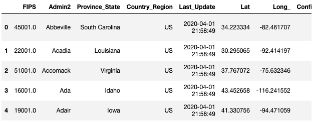

 

#### 데이터프레임에서 Series 추출하기

- 하나의 feature(column)만 선택하면 됨

<pre>
contries = doc['Country_Region']
contries.head()
</pre>

<pre>
출력 예:
	0    US
	1    US
	2    US
	3    US
	4    US
	Name: Country_Region, dtype: object
</pre>

 

#### Series 로 feature를 보다 상세하게 탐색하기

- size : 사이즈 반환
- count() : 데이터가 없는 경우를 뺀 사이즈 반환
- unique(): 유일한 값만 반환
- value_counts(): 데이터가 없는 경우를 제외하고, 각 값의 갯수를 반환

<pre>
print(contries.size, contries.count())
</pre>

<pre>
출력 예:
	2483 2483
</pre>

<pre>
print(contries.unique())
print()
print(len(contries.unique()))
</pre>

<pre>
출력 예:
	['US' 'Canada' 'United Kingdom' 'China' 'Netherlands' 'Australia'
	 'Denmark' 'France' 'Afghanistan' 'Albania' 'Algeria' 'Andorra' 'Angola'
	 'Antigua and Barbuda' 'Argentina' 'Armenia' 'Austria' 'Azerbaijan'
	 'Bahamas' 'Bahrain' 'Bangladesh' 'Barbados' 'Belarus' 'Belgium' 'Belize'
	 'Benin' 'Bhutan' 'Bolivia' 'Bosnia and Herzegovina' 'Botswana' 'Brazil'
	 'Brunei' 'Bulgaria' 'Burkina Faso' 'Burma' 'Burundi' 'Cabo Verde'
	 'Cambodia' 'Cameroon' 'Central African Republic' 'Chad' 'Chile'
	 'Colombia' 'Congo (Brazzaville)' 'Congo (Kinshasa)' 'Costa Rica'
	 "Cote d'Ivoire" 'Croatia' 'Cuba' 'Cyprus' 'Czechia' 'Diamond Princess'
	 'Djibouti' 'Dominica' 'Dominican Republic' 'Ecuador' 'Egypt'
	 'El Salvador' 'Equatorial Guinea' 'Eritrea' 'Estonia' 'Eswatini'
	 'Ethiopia' 'Fiji' 'Finland' 'Gabon' 'Gambia' 'Georgia' 'Germany' 'Ghana'
	 'Greece' 'Grenada' 'Guatemala' 'Guinea' 'Guinea-Bissau' 'Guyana' 'Haiti'
	 'Holy See' 'Honduras' 'Hungary' 'Iceland' 'India' 'Indonesia' 'Iran'
	 'Iraq' 'Ireland' 'Israel' 'Italy' 'Jamaica' 'Japan' 'Jordan' 'Kazakhstan'
	 'Kenya' 'Korea, South' 'Kosovo' 'Kuwait' 'Kyrgyzstan' 'Laos' 'Latvia'
	 'Lebanon' 'Liberia' 'Libya' 'Liechtenstein' 'Lithuania' 'Luxembourg'
	 'MS Zaandam' 'Madagascar' 'Malaysia' 'Maldives' 'Mali' 'Malta'
	 'Mauritania' 'Mauritius' 'Mexico' 'Moldova' 'Monaco' 'Mongolia'
	 'Montenegro' 'Morocco' 'Mozambique' 'Namibia' 'Nepal' 'New Zealand'
	 'Nicaragua' 'Niger' 'Nigeria' 'North Macedonia' 'Norway' 'Oman'
	 'Pakistan' 'Panama' 'Papua New Guinea' 'Paraguay' 'Peru' 'Philippines'
	 'Poland' 'Portugal' 'Qatar' 'Romania' 'Russia' 'Rwanda'
	 'Saint Kitts and Nevis' 'Saint Lucia' 'Saint Vincent and the Grenadines'
	 'San Marino' 'Saudi Arabia' 'Senegal' 'Serbia' 'Seychelles'
	 'Sierra Leone' 'Singapore' 'Slovakia' 'Slovenia' 'Somalia' 'South Africa'
	 'Spain' 'Sri Lanka' 'Sudan' 'Suriname' 'Sweden' 'Switzerland' 'Syria'
	 'Taiwan*' 'Tanzania' 'Thailand' 'Timor-Leste' 'Togo'
	 'Trinidad and Tobago' 'Tunisia' 'Turkey' 'Uganda' 'Ukraine'
	 'United Arab Emirates' 'Uruguay' 'Uzbekistan' 'Venezuela' 'Vietnam'
	 'West Bank and Gaza' 'Zambia' 'Zimbabwe']
	
	180
</pre>

<pre>
countries.value_counts()
</pre>

<pre>
출력 예:
	US                2228
	China               33
	Canada              15
	United Kingdom      10
	France              10
	                  ... 
	Belize               1
	Chile                1
	Botswana             1
	Uganda               1
	Hungary              1
	Name: Country_Region, Length: 180, dtype: int64
</pre>

 

---

 

### 2. 필요한 컬럼만 선택하기

- 여러 컬럼을 선택하면, 별도의 데이터프레임이 됨

<pre>
covid_stat = doc[['Confirmed', 'Deaths', 'Recovered']]
covid_stat.head()
</pre>

출력 예:

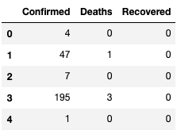

 

---

 

### 3. 특정 조건에 맞는 row 검색하기

<pre>
doc = pd.read_csv(PATH + "04-01-2020.csv", encoding='utf-8-sig')
</pre>

<pre>
doc_us = doc[doc['Country_Region'] == 'US']
doc_us	# print 생략됨. 앞으로도 이런 식으로 많이 기입 하겠음.
</pre>

출력 예:

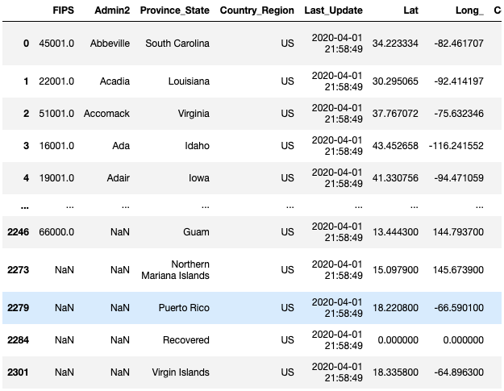

 

---

 

### 4. 없는 데이터(NaN) 처리하기

- 없는 데이터(결측치) 가 있는지 확인하기
  - isnull() : 없는 데이터가 있는지 확인 (True or False)
  - sum() : 없는 데이터가 있는 행의 갯수 확인 
  - 통상 isnull().sum() 으로 사용

<pre>
doc = pd.read_csv(PATH + "01-22-2020.csv", encoding='utf-8-sig')
doc.isnull().sum()
</pre>

<pre>
출력 예:
	Province/State     3
	Country/Region     0
	Last Update        0
	Confirmed          9
	Deaths            37
	Recovered         37
	dtype: int64
</pre>

 

#### 없는 데이터 삭제하기

- dropna() : 결측치를 가진 행을 모두 삭제

<pre>
doc = pd.read_csv(PATH + "01-22-2020.csv", encoding='utf-8-sig')
doc = doc.dropna()
doc.head()
</pre>

출력 예:

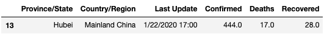

 

#### 특정 컬럼값이 없는 데이터만 삭제하기

- subset으로 해당 컬럼을 지정해줌

<pre>
doc = pd.read_csv(PATH + "01-22-2020.csv", encoding='utf-8-sig')
doc = doc.dropna(subset=['Confirmed'])
doc.head()
</pre>

출력 예:

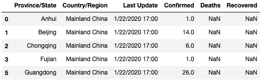

 

#### 없는 데이터(NaN)을 특정값으로 일괄 변경하기

- fillna(특정값) : 특정값으로 결측치를 대체

<pre>
doc = pd.read_csv(PATH + "01-22-2020.csv", encoding='utf-8-sig')
doc = doc.fillna(0)
doc.head()
</pre>

출력 예:

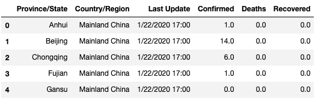

 

#### 없는 데이터(NaN)중 특정 컬럼에 대해 특정 값으로 일괄 변경하기

- 별도 사전 데이터를 생성, 없는 데이터를 변경할 컬럼명만 키로 만들고, 변경할 특정 값을 키값으로 넣고, fillna() 함수에 적용해주면 됨

<pre>
doc = pd.read_csv(PATH + "01-22-2020.csv", encoding='utf-8-sig')
nan_data = {'Deaths': 0, 'Recovered': 0}
doc = doc.fillna(nan_data)
doc.head()
</pre>

출력 예:

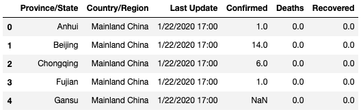

 

---

 

### 5. 특정 키값을 기준으로 데이터 합치기

- groupby() : SQL 구문의 group by 와 동일, 특정 컬럼을 기준으로 그룹
- sum() : 그룹으로 되어 있는 데이터를 합치기

<pre>
doc = pd.read_csv(PATH + "04-01-2020.csv", encoding='utf-8-sig')
doc.head()
</pre>

출력 예:

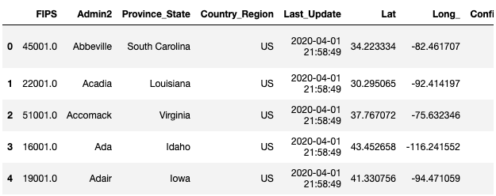

<pre>
doc = doc.groupby('Country_Region').sum()
doc.head()
</pre>

출력 예:

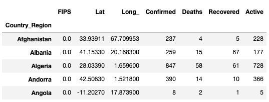

- groupby 에 의해서, index가 Country_Region 의 각 국가로 변경됨

<pre>
doc.columns
</pre>

<pre>
출력 예:
	Index(['FIPS', 'Lat', 'Long_', 'Confirmed', 'Deaths', 'Recovered', 'Active'], dtype='object')
</pre>

<pre>
doc.index
</pre>

<pre>
출력 예:
	Index(['Afghanistan', 'Albania', 'Algeria', 'Andorra', 'Angola',
	       'Antigua and Barbuda', 'Argentina', 'Armenia', 'Australia', 'Austria',
	       ...
	       'Ukraine', 'United Arab Emirates', 'United Kingdom', 'Uruguay',
	       'Uzbekistan', 'Venezuela', 'Vietnam', 'West Bank and Gaza', 'Zambia',
	       'Zimbabwe'],
	      dtype='object', name='Country_Region', length=180)
</pre>

 

- index로 검색해서 US 의 합계 검색 가능

<pre>
doc[doc.index == 'US']
</pre>

출력 예:

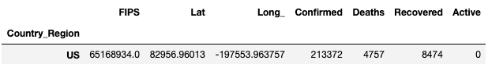

 

---

 

### 6. 컬럼 타입 변경하기

- pandas에서 데이터 타입은 dtype 으로 불리우며, 주요 데이터 타입은 다음과 같음
  - object 는 파이썬의 str 또는 혼용 데이터 타입 (문자열)
  - int64 는 파이썬의 int (정수)
  - float64 는 파이썬의 float (부동소숫점)
  - bool 는 파이썬의 bool (True 또는 False 값을 가지는 boolean)

<pre>
import pandas as pd
PATH = "COVID-19-master/csse_covid_19_data/csse_covid_19_daily_reports/"
</pre>

<pre>
doc = pd.read_csv(PATH + "01-22-2020.csv", encoding='utf-8-sig')
doc = doc[['Country/Region', 'Confirmed']]
doc.info()
</pre>

<pre>
출력 예:
	<class 'pandas.core.frame.DataFrame'>
	RangeIndex: 38 entries, 0 to 37
	Data columns (total 2 columns):
	 #   Column          Non-Null Count  Dtype  
	---  ------          --------------  -----  
	 0   Country/Region  38 non-null     object 
	 1   Confirmed       29 non-null     float64
	dtypes: float64(1), object(1)
	memory usage: 736.0+ bytes
</pre>

<pre>
doc.head()
</pre>

출력 예:

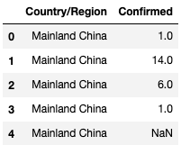

 

- astype({컬럼명: 변경할타입}) : 특정 컬럼의 타입을 변경
  - 변경할 데이터에 없는 데이터(NaN)이 있을 경우, 에러가 날 수 있음

<pre>
doc = pd.read_csv(PATH + "01-22-2020.csv", encoding='utf-8-sig')
doc = doc[['Country/Region', 'Confirmed']] # 필요한 컬럼만 선택하기
doc = doc.dropna(subset=['Confirmed'])     # 특정 컬럼에 없는 데이터 삭제하기
doc = doc.astype({'Confirmed': 'int64'})   # 특정 컬럼의 데이터 타입 변경하기
doc.info()
</pre>

<pre>
출력 예:
	< class 'pandas.core.frame.DataFrame' >
	Int64Index: 29 entries, 0 to 37
	Data columns (total 2 columns):
	 #   Column          Non-Null Count  Dtype 
	---  ------          --------------  ----- 
	 0   Country/Region  29 non-null     object
	 1   Confirmed       29 non-null     int64 
	dtypes: int64(1), object(1)
	memory usage: 696.0+ bytes
</pre>

<pre>
doc.head()
</pre>

출력 예:

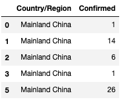

 

---

 

### 7. 데이터프레임 컬럼명 변경하기

- columns 로 컬럼명을 변경할 수 있음

<pre>
doc = pd.read_csv(PATH + "01-22-2020.csv", encoding='utf-8-sig')
doc = doc[['Country/Region', 'Confirmed']] # 필요한 컬럼만 선택하기
</pre>

<pre>
doc.columns
</pre>

<pre>
출력 예:
	Index(['Country/Region', 'Confirmed'], dtype='object')
</pre>

<pre>
doc.columns = ['Country_Region', 'Confirmed']
</pre>

<pre>
doc.columns
</pre>

<pre>
출력 예:
	Index(['Country_Region', 'Confirmed'], dtype='object')
</pre>

 

---

 

### 8. 데이터프레임에서 중복 행 확인/제거하기

- duplicated() : 중복 행 확인하기

<pre>
doc = pd.read_csv("COVID-19-master/csse_covid_19_data/UID_ISO_FIPS_LookUp_Table.csv", encoding='utf-8-sig')
doc = doc[['iso2', 'Country_Region']]
doc
</pre>

출력 예:

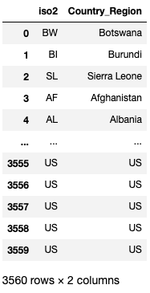

<pre>
doc.duplicated()
</pre>

<pre>
출력 예:
	0       False
	1       False
	2       False
	3       False
	4       False
	        ...  
	3555     True
	3556     True
	3557     True
	3558     True
	3559     True
	Length: 3560, dtype: bool
</pre>

 

- 중복된 행만 확인하기

<pre>
doc[doc.duplicated()]
</pre>

출력 예:

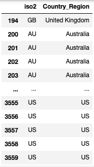

 

- drop_duplicates() : 중복 행 삭제중복값
  - 특정 컬럼을 기준으로 중복 행 제거하기
	  - subset=특정컬럼
  - 중복된 경우, 처음과 마지막 행 중 어느 행을 남길 것인지 결정하기 
    	- 처음: keep='first' (디폴트)
    	- 처음: keep='last'

<pre>
doc = doc.drop_duplicates(subset='Country_Region', keep='last')
doc
</pre>

출력 예:

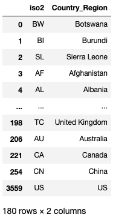