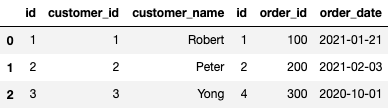

# pandas 라이브러리로 데이터프레임 합치기

- (참고) 해당 블로그에서는 print() 가 생략되는 예제가 많이 있음

 

### 1. 두 데이터프레임 연결하기

<pre>
import pandas as pd
</pre>

<pre>
df1 = pd.DataFrame({
    'id': [1, 2, 3],
    'customer_id': [1, 2, 3],
    'customer_name': ['Robert', 'Peter', 'Yong']
}, columns=['id', 'customer_id', 'customer_name'])
df1
</pre>

출력 예:

<pre>
df2 = pd.DataFrame({
    'id': [1, 2, 4],
    'order_id': [100, 200, 300],
    'order_date': ['2021-01-21', '2021-02-03', '2020-10-01']
}, columns=['id', 'order_id', 'order_date'])
df2
</pre>

출력 예:

 

#### concat(): 두 데이터프레임을 연결해서 하나의 데이터프레임으로 만들 수 있음

- 두 데이터프레임을 위/아래 또는 왼쪽/오른쪽으로 연결하기만 함
- pd.concat([데이터프레임1, 데이터프레임2])

<pre>
pd.concat([df1, df2])
</pre>

출력 예:

 

#### axis: 0 이면(디폴트) 위에서 아래로 합치고, 1 이면 왼쪽과 오른쪽으로 합침

<pre>
doc = pd.concat([df1, df2], axis=1)
doc.head()
</pre>

출력 예:

 

---

 

### 2. 두 데이터프레임 합치기(병합하기)

#### merge(): 두 데이터프레임을 합치기

- merge(데이터프레임1, 데이터프레임2) : 두 데이터프레임에 동일한 이름을 가진 컬럼을 기준으로 두 데이터프레임을 합침

<pre>
pd.merge(df1, df2)
</pre>

출력 예:

 

- merge(데이터프레임1, 데이터프레임2, on=기준컬럼명) : 기준 컬럼을 명시할 수도 있음

<pre>
pd.merge(df1, df2, on='id')
</pre>

출력 예:

 

#### merge() 를 통해 어떻게 두 데이터프레임을 결함시킬 것인가에 대해 보다 상세한 기능을 제공함

- merge(데이터프레임1, 데이터프레임2, how=결합방법) 
- 결합방법
  1. inner : 내부 조인 - SQL의 INNER JOIN 과 동일
  2. outer : 완전 외부 조인 - SQL의 OUTER JOIN 과 동일
  3. left : 왼쪽 우선 외부 조인 - SQL의 LEFT OUTER JOIN 과 동일
  4. right : 오른쪽 우선 외부 조인 - SQL의 RIGHT OUTER JOIN 과 동일

 

#### 참고: merge() 함수는 SQL의 JOIN 기능과 동일함

- SQL JOIN: 두 개 이상의 테이블로부터 필요한 데이터를 연결해 하나의 포괄적인 구조로 결합시키는 연산

 

#### 1. inner : 내부 조인 - SQL의 INNER JOIN 과 동일 (디폴트)

- 동작 방식
  1. on의 컬럼값이 두 데이터프레임에서 동일한 행 찾기
  2. 각 동일한 행의 컬럼/컬럼값만 가져오기
  
  

<pre>
### 사전 선언
import pandas as pd
df1 = pd.DataFrame({
    'id': [1, 2, 3],
    'customer_id': [1, 2, 3],
    'customer_name': ['Robert', 'Peter', 'Yong']
}, columns=['id', 'customer_id', 'customer_name'])
df2 = pd.DataFrame({
    'id': [1, 2, 4],
    'order_id': [100, 200, 300],
    'order_date': ['2021-01-21', '2021-02-03', '2020-10-01']
}, columns=['id', 'order_id', 'order_date'])
</pre>

<pre>
pd.merge(df1, df2, on='id') # inner 방식이 디폴트이므로 별도로 써주지 않아도 됨
</pre>

출력 예:

 

<pre>
pd.merge(df1, df2, on='id', how='inner') # 명시적으로 써주기 위해 how 옵션을 써줄 수도 있음
</pre>

출력 예:

 
 

#### 2. outer : 완전 외부 조인 - SQL의 OUTER JOIN 과 동일

- 동작 방식
  1. on의 컬럼값이 두 데이터프레임에서 동일한 행 찾기
  2. 각 동일한 행의 컬럼/컬럼값 가져와 붙이기
  3. 각 데이터프레임에서 on의 컬럼값이 다른 나머지 행을 찾기
  4. 각 나머지 행의 컬럼/컬럼값을 가져와 별도 행으로 붙이기
     - 두 데이터프레임 각각에만 있는 컬럼이어서, 컬럼값이 없을 경우 데이터 없음(NaN)으로 표기하기
     
       
  
<pre>
### 사전 선언
import pandas as pd
df1 = pd.DataFrame({
    'id': [1, 2, 3],
    'customer_id': [1, 2, 3],
    'customer_name': ['Robert', 'Peter', 'Yong']
}, columns=['id', 'customer_id', 'customer_name'])
df2 = pd.DataFrame({
    'id': [1, 2, 4],
    'order_id': [100, 200, 300],
    'order_date': ['2021-01-21', '2021-02-03', '2020-10-01']
}, columns=['id', 'order_id', 'order_date'])
</pre>

<pre>
pd.merge(df1, df2, on='id', how='outer')
</pre>

출력 예:

 
 

#### 3. left : 왼쪽 우선 외부 조인 - SQL의 LEFT OUTER JOIN 과 동일

- 동작 방식
  1. 왼쪽 데이터프레임의 행을 모두 가져오기
  2. 왼쪽 데이터프레임의 행에 있는 on의 컬럼값이 동일한 오른쪽 데이터프레임의 행만 컬럼과 함께 가져와 붙이기
  3. 오른쪽 데이터프레임에 없는 on의 컬럼값을 가진 왼쪽 데이터프레임의 오른쪽 데이터프레임 컬럼들에는 데이터 없음(NaN)으로 표기하기
     
    
 
<pre>
### 사전 선언
import pandas as pd
df1 = pd.DataFrame({
'id': [1, 2, 3],
'customer_id': [1, 2, 3],
'customer_name': ['Robert', 'Peter', 'Yong']
}, columns=['id', 'customer_id', 'customer_name'])
df2 = pd.DataFrame({
'id': [1, 2, 4],
'order_id': [100, 200, 300],
'order_date': ['2021-01-21', '2021-02-03', '2020-10-01']
}, columns=['id', 'order_id', 'order_date'])
</pre>
 
<pre>
pd.merge(df1, df2, on='id', how='left')
</pre>
  
출력 예:

  

 
 

#### 4. right : 오른쪽 우선 외부 조인 - SQL의 RIGHT OUTER JOIN 과 동일
- 동작 방식
  1. 오른쪽 데이터프레임의 행을 모두 가져오기
  2. 오른쪽 데이터프레임의 행에 있는 on의 컬럼값이 동일한 왼쪽 데이터프레임의 행만 컬럼과 함께 가져와 붙이기
  3. 왼쪽 데이터프레임에 없는 on의 컬럼값을 가진 오른쪽 데이터프레임의 왼쪽 데이터프레임 컬럼들에는 데이터 없음(NaN)으로 표기하기
     
       
  

<pre>
### 사전 선언
import pandas as pd
df1 = pd.DataFrame({
    'id': [1, 2, 3],
    'customer_id': [1, 2, 3],
    'customer_name': ['Robert', 'Peter', 'Yong']
}, columns=['id', 'customer_id', 'customer_name'])
df2 = pd.DataFrame({
    'id': [1, 2, 4],
    'order_id': [100, 200, 300],
    'order_date': ['2021-01-21', '2021-02-03', '2020-10-01']
}, columns=['id', 'order_id', 'order_date'])
</pre>  

<pre>
pd.merge(df1, df2, on='id', how='right')
</pre>

출력 예:

  

 

---

 

### 컬럼이 아닌 인덱스를 기준 컬럼으로 사용하기

- merge(데이터프레임1, 데이터프레임2, left_index=True, right_index=True) : 기준 컬럼을 명시할 수도 있음

<pre>
### 사전 선언
import pandas as pd
df1 = pd.DataFrame({
    'id': [1, 2, 3],
    'customer_id': [1, 2, 3],
    'customer_name': ['Robert', 'Peter', 'Yong']
}, columns=['id', 'customer_id', 'customer_name'])
df2 = pd.DataFrame({
    'id': [1, 2, 4],
    'order_id': [100, 200, 300],
    'order_date': ['2021-01-21', '2021-02-03', '2020-10-01']
}, columns=['id', 'order_id', 'order_date'])
</pre>

<pre>
df1 = df1.set_index('id')
df1
</pre>

출력 예:

  

<pre>
df2 = df2.set_index('id')
df2
</pre>

출력 예:

  

 

데이터프레임 조작하기 연습 
    
- 위 두 데이터프레임을 인덱스를 기준으로 합치기 (inner join)

<pre>
### 사전 선언
import pandas as pd
df1 = pd.DataFrame({
    'id': [1, 2, 3],
    'customer_id': [1, 2, 3],
    'customer_name': ['Robert', 'Peter', 'Yong']
}, columns=['id', 'customer_id', 'customer_name'])
df2 = pd.DataFrame({
    'id': [1, 2, 4],
    'order_id': [100, 200, 300],
    'order_date': ['2021-01-21', '2021-02-03', '2020-10-01']
}, columns=['id', 'order_id', 'order_date'])
</pre>

<pre>
pd.merge(df1, df2, left_index=True, right_index=True)
</pre>

출력 예:

  

 

데이터프레임 조작하기 연습 
    
- 위 두 데이터프레임을 인덱스를 기준으로 합치기 (outer join)

<pre>
### 사전 선언
import pandas as pd
df1 = pd.DataFrame({
    'id': [1, 2, 3],
    'customer_id': [1, 2, 3],
    'customer_name': ['Robert', 'Peter', 'Yong']
}, columns=['id', 'customer_id', 'customer_name'])
df2 = pd.DataFrame({
    'id': [1, 2, 4],
    'order_id': [100, 200, 300],
    'order_date': ['2021-01-21', '2021-02-03', '2020-10-01']
}, columns=['id', 'order_id', 'order_date'])
</pre>

<pre>
pd.merge(df1, df2, how='outer', left_index=True, right_index=True)
</pre>

출력 예:

  