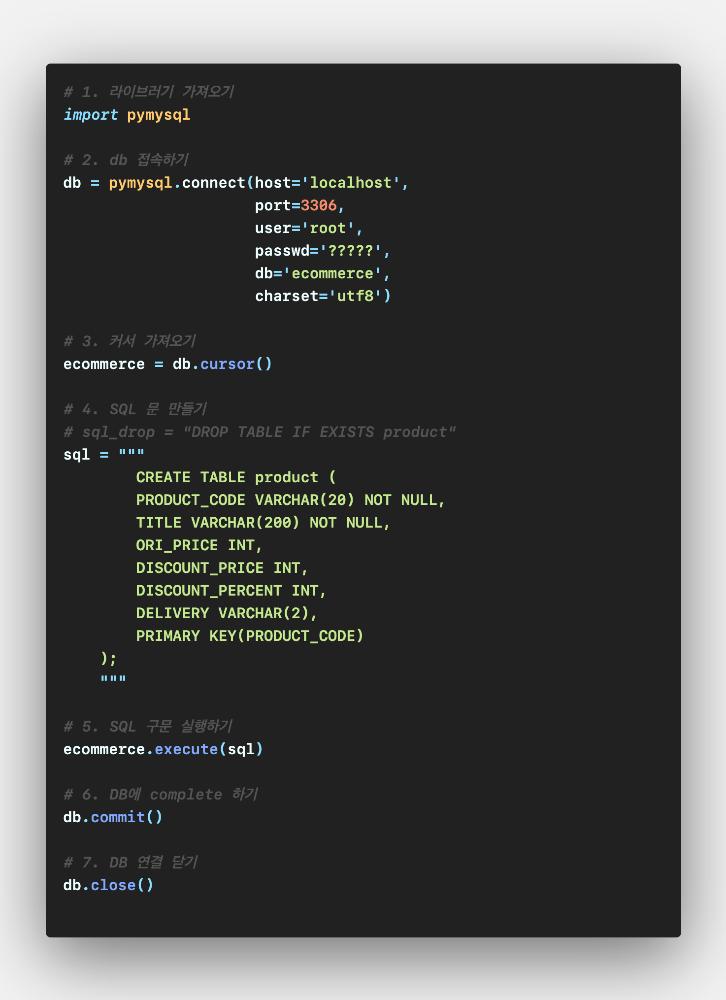
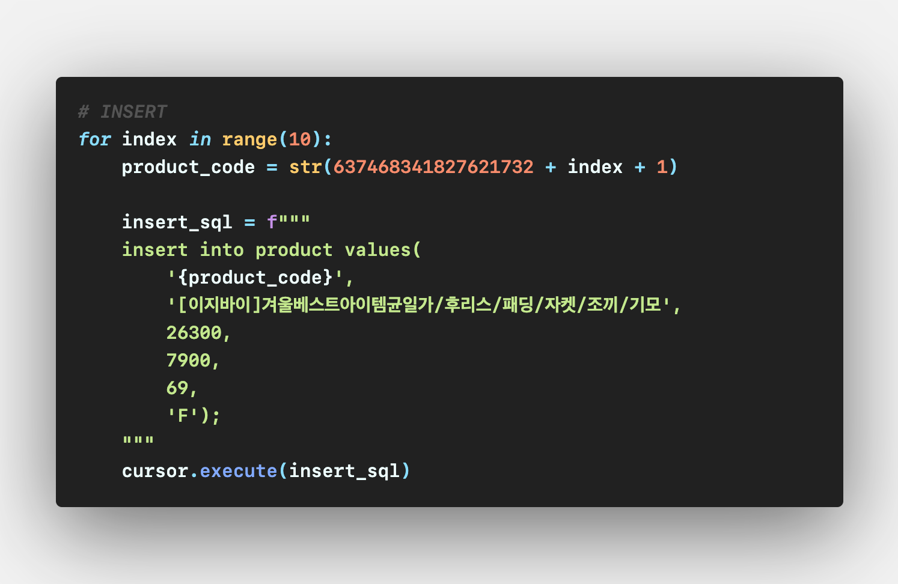
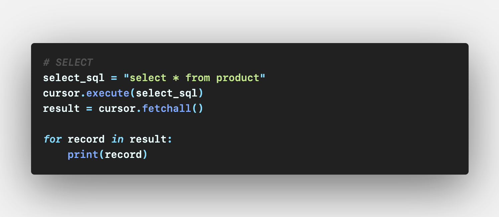
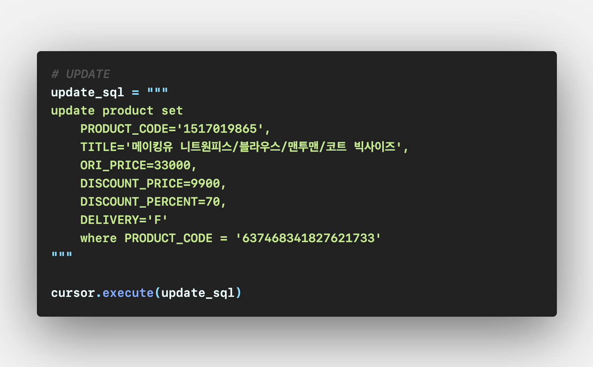
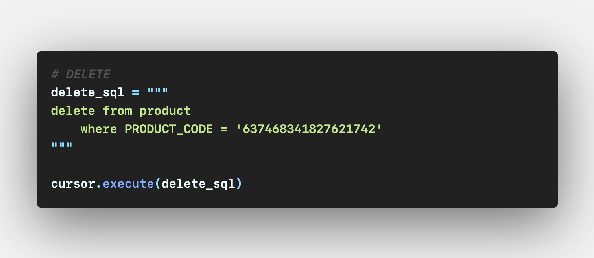

# PyMySQL

### pymysql 기본 패턴

 

 

#### 이제부터 나오는 삽입, 검색, 갱신 삭제문은 기본 양식의 4번, 5번 코멘트 부분에 입력하면 됨

 

---

 

### 데이터 삽입 (INSERT)

 

 

---

 

### 데이터 검색 (SELECT)

 

 

---

 

### 데이터 갱신

 

 

---

 

### 데이터 삭제

 

